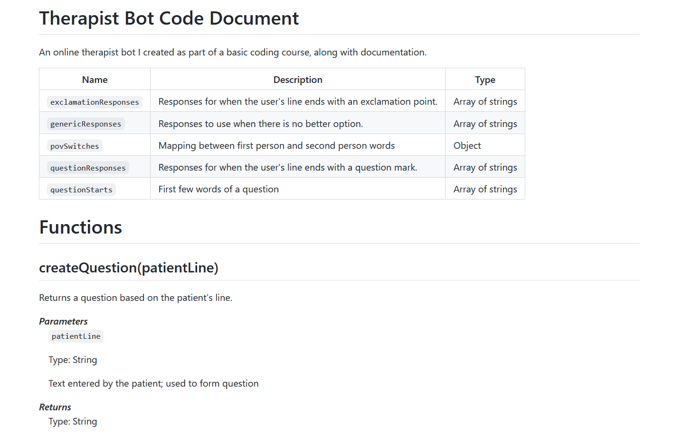

## Bridging People and Technology

Hello! Thanks for visiting my portfolio. Below are my technical documentation projects, skills, completed courses, and education. 

You can contact me on [LinkedIn](https://www.linkedin.com/in/joe-wainer-67264078/) or by email: <hello@joewainer.com> 

## Open Weather Map API 

This [API document](https://app.swaggerhub.com/apis-docs/Joe99/WeatherMapAPI/2.5) is built according to the OpenAPI 3.0 specification and written in YAML. I built this API as part of an online API documentation course. It's written and hosted on [SwaggerHub](https://swagger.io/). 

With this API, you can get: 
* The current weather, daily forecast for 16 days, and a three-hour-interval forecast for 5 days for your city. 
* Helpful stats, graphics, and this day in history charts are available for your reference. 
* Interactive maps show precipitation, clouds, pressure, wind around your location stations. 
* Data is available in JSON, XML, or HTML format.

## Therapist Bot App and Documentation 

I wrote the code for a Therapist Bot as part of an online course in JavaScript, plus documentation detailing each function, constant, and enumeration. 

You can try the [working demo](https://joewainer.github.io/therapist-bot/) and [view the code on GitHub](https://github.com/JoeWainer/therapist-bot/blob/main/index.html). I created the [document](https://github.com/JoeWainer/therapist-bot/blob/main/README.md) using Markdown.

## Stripe Record Usage API 

This [API document](https://app.swaggerhub.com/apis-docs/JoeWainer/StripeUsageRecordsMock/2021-12-15/
) allows Stripe users to report customer usage and metrics to stripe for metered billing of subscription prices. 

I wrote the API document as part of a course on OpenAPI specification and swagger. The project was to recreate the [Record Usage section](https://stripe.com/docs/api/usage_records) from Swipe's documentation. 

 
## Skills
 
 - Read and write code samples in HTML, CSS, Flutter, SWIFT, JavaScript
 - Work in Agile software development environments 
 - Version control and collaboration tools; Monday, JIRA, MadCap Flare, GitHub
 - Open tools; Swagger, Postman, OpenAPI

## Education

**Technical Writing Certificate @ Ourbestwords.com (in progress)**

- Technical Communication Skills
- Technical Communication Tools
- Documenting Procedures
- Editing and Writing for Localisation 
- MadCap Flare

**Completed Programming/API Technical Writing Courses @ Udemy.com**

- Coding for Writers: Basic Programming (JavaScript)
- The Art of API Documentation
- Learn API Technical Writing: JSON and XML for writers
- Learn API Technical Writing: REST for Writers
- Flutter Development Bootcamp with Dart
- iOS & Swift: The Complete iOS App Development Bootcamp

**Ashmole Science Academy, London**

