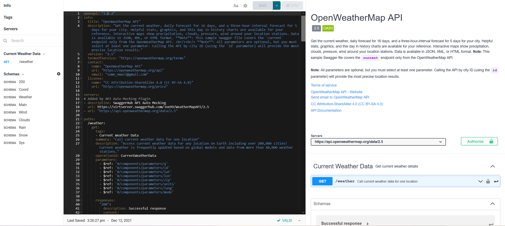
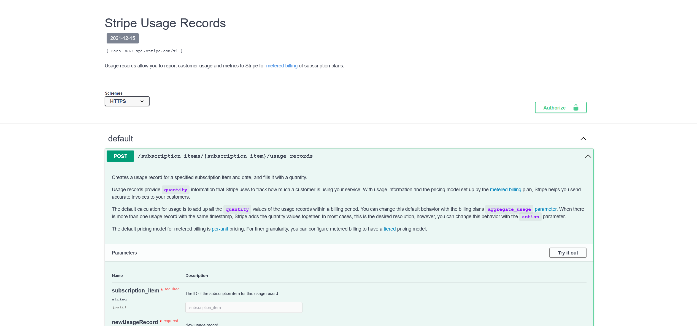

Hello! Thanks for visiting my portfolio. Below are my technical documentation projects, skills, completed courses and education. 

You can contact me on [LinkedIn](https://www.linkedin.com/in/joe-wainer-67264078/) or by email <hello@joewainer.com> 

## OpenWeatherMap API 

This [API document](https://app.swaggerhub.com/apis-docs/Joe99/WeatherMapAPI/2.5) is built according to the OpenAPI 3.0 specification and written in YAML. I built this API as part of an online API documentation course. It's written and hosted on [SwaggerHub](https://swagger.io/). 

With this API you can get: 
* The current weather, daily forecast for 16 days, and a three-hour-interval forecast for 5 days for your city. 
* Helpful stats, graphics, and this day in history charts are available for your reference. 
* Interactive maps show precipitation, clouds, pressure, wind around your location stations. 
* Data is available in JSON, XML, or HTML format.

https://app.swaggerhub.com/apis-docs/JoeWainer/StripeUsageRecordsMock/2021-12-15/

## Stripe Record Usage API 

This [API document](https://app.swaggerhub.com/apis-docs/JoeWainer/StripeUsageRecordsMock/2021-12-15/
) allows Stripe users to report customer usage and metrics to stripe for metered billing of subscription prices. 

I wrote the API document as part of a course on OpenAPI specification and swagger. The goal was to recreate the [Record Usage section](https://stripe.com/docs/api/usage_records) fron Swipe's documenation in Swagger. 

